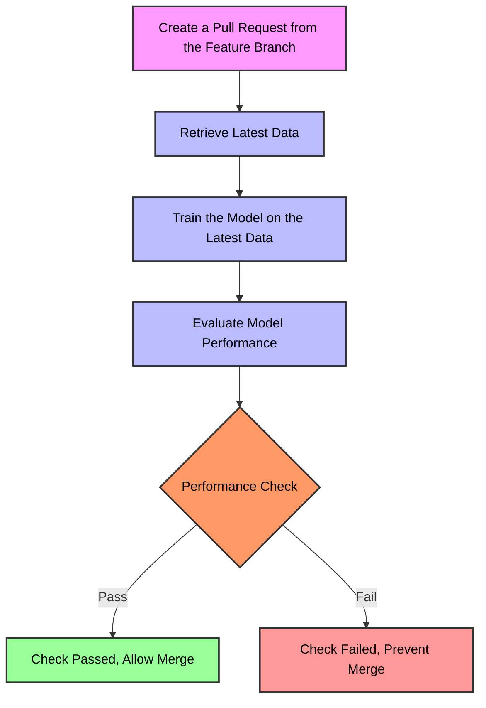
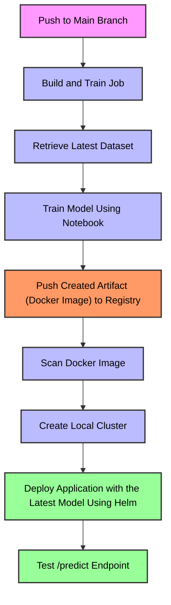

# Machine Learning MNIST Model and Pipeline 🚀

## Table of Contents
- [Overview](#overview)
- [Key Components](#key-components)
- [Pipeline Diagram](#pipeline-diagram)
  - [Model Retraining and Evaluation](#1-model-retraining-and-evaluation)
  - [Model Training, Building, Image Scanning and Deployment](#2-model-training-building-image-scanning-and-deployment-to-the-local-kubernetes-cluster)
- [Bonus](#bonus)

---

## Overview

This repository contains a machine learning pipeline for training, evaluating and deploying models using GitHub Actions workflows. The pipeline is designed to automate the retraining of models, evaluate their performance against the current production model and deploy the new model if it performs better. The repository also includes CI/CD workflow for building, scanning and deploying the application to a Kubernetes cluster.

## Key Components

### **1. Retrain Workflow**
- **Purpose**: Retrains the model using new data and evaluates its performance against the production model.
- **Logic**:
  - If the retrained model performs better, the check passes, allowing the user to merge changes to the main (default) branch and deploy the new model to production.
  - If the retrained model performs worse, the check fails, preventing deployment.

### **2. CI/CD Workflow**
- **Purpose**: Deliver new model and use it in the API endpoint `/predict`.
- **Jobs**:
  - **Build and Train**:
    - Retrieves the latest dataset.
    - Trains the model.
    - Builds a Docker image for the application.
  - **Scan**:
    - Runs a vulnerability scan on the Docker image using Trivy.
  - **Create Cluster and Deploy**:
    - Sets up a Minikube cluster.
    - Deploys the application using Helm.
    - Tests the `/predict` endpoint of the deployed application.

## Pipeline Diagram

Below are Mermaid diagrams that illustrate the logic of the pipeline. It consist mainly of two parts:

### **1. Model retraining and evaluation**

### **2. Model training, building, image scanning and deployment to the local kubernetes cluster**

## Bonus

Images downloaded from the AWS S3 bucket and located in the repository under the [images/bonus](./images/bonus) came damaged - they are a set of random white, black, and gray pixels instead of resembling MNIST-like handwritten digits. If we train the model on such data this will lead to the issues, like poor performance, overfitting (model will learn pattern form the incorrect data - noise), it will waste resources and could cause deplyment risk.

The possible solutions could be:

1. Already implemented model retraining which would be added as a mandatory check, additional rules to prevent from merges to the default branch.
2. Data verification and inspection vefore training to ensure it matches the expected format and quality (check with matplotlib, check dimensions, pixel values).
3. The dataset should be checked, if the number of the corrupted data isn't huge, it's then possible to apply data augmentation, generate synthetic data or simply combine it with already existing data from other weeks.
4. Important part in such scenarions is communication. If the dataset is provided by a third party or some team the issue should be reported to the provider and request a corrected dataset.